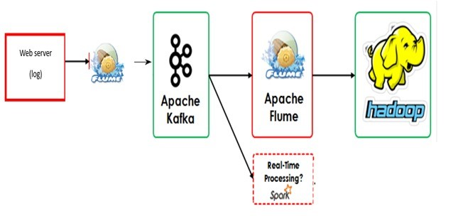

# Real-Time Log Processing Infrastructure with Apache Flume, Kafka, Spark & Hadoop

This project simulates a real-time log processing pipeline using Apache Big Data tools. It streams web server logs and processes them using both batch and real-time methods.

## 🔧 Tools Used

- **Apache Flume** – for log ingestion
- **Apache Kafka** – for data distribution
- **Apache Spark** – for real-time processing
- **Apache Hadoop (HDFS)** – for batch storage

---

## 📊 Architecture



---

## 🧪 Components

### 1. `lab-logs.sh`
Simulates web server logs every 2 seconds and writes them to a file.

### 2. `flume-to-kafka.conf`
Flume agent that reads the log file and sends data to a Kafka topic `web-logs`.

### 3. `kafka-to-hdfs.conf`
Another Flume agent that reads from the Kafka topic and stores the logs in HDFS for batch processing.

### 4. `kafka-to-spark.py`
A PySpark application that reads from Kafka in real-time and displays the logs on the console.

---

## 🚀 How to Run

1. **Start Kafka & HDFS**  
   Make sure Kafka and HDFS are up and running on your machine.

2. **Run log generator**
   ```bash
   chmod +x lab-logs.sh
   ./lab-logs.sh


3. **Start Flume agent to Kafka**

   ```bash
   flume-ng agent -n agent -c conf -f flume-to-kafka.conf
   ```

4. **Start Flume agent to HDFS**

   ```bash
   flume-ng agent -n agent2 -c conf -f kafka-to-hdfs.conf
   ```

5. **Start Spark Streaming**

   ```bash
   spark-submit kafka-to-spark.py
   ```

---

## 📂 Output

* **Batch**: Data will be saved in HDFS under `/user/bigdata/web-logs`
* **Real-Time**: Logs are printed live in the Spark console

---

## 📌 Kafka Topic Used

* `web-logs`

